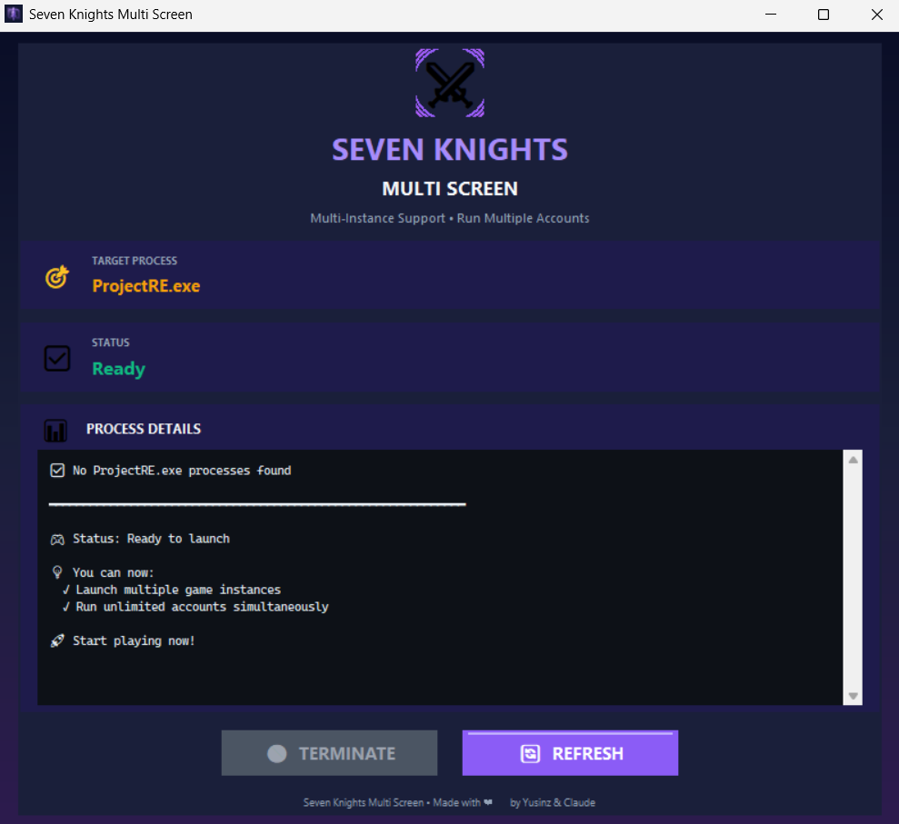

# 7K-Multi-Screen (Seven Knights Rebirth)

**7K-Multi-Screen** เป็นโปรแกรม Open Source ขนาดเล็กที่ออกแบบมาเพื่อช่วยให้นักเล่นเกม **Seven Knights Rebirth** สามารถเปิดตัวเกมได้หลายหน้าจอ (Multi-instance) บนคอมพิวเตอร์เครื่องเดียวกัน โดยการจัดการกับระบบตรวจสอบ Instance ของตัวเกม

---

## 🛡️ Security & Transparency (ความปลอดภัยและความโปร่งใส)

เนื่องจากโปรแกรมนี้มีการเข้าถึง Process ในระบบเพื่อจัดการ Mutex ตัว Windows Defender หรือ Antivirus บางตัวอาจตรวจจับว่าเป็นความเสี่ยง (False Positive) เพื่อความสบายใจของผู้ใช้งาน คุณสามารถตรวจสอบผลการสแกนไฟล์อย่างละเอียดได้ที่นี่:

* **Scan Result:** [คลิกเพื่อดูผลการสแกนไฟล์ .exe โดยละเอียด](https://www.virustotal.com/gui/file/21721f69c73b085527b9a4f0425c516f0b7e7dc519cb125f935f971ff107491a/detection)
* **Status:** ✅ ปลอดภัย ไม่มีมัลแวร์แฝง (4/71 detections)
* **Status:** ✅ Update 5/3/2026

---

## 📸 Screenshots (ภาพตัวอย่าง)

นี่คือตัวอย่างภายในโปรแกม:

### 📺 วิดีโอสอนการใช้งาน (How to Use Video)

---

## 🌟 Features (คุณสมบัติ)

* **Multi-Instance Unlock:** ปลดล็อกข้อจำกัดมาตรฐานของเกม ทำให้เปิดได้มากกว่า 1 จอ
* **Simple Interface:** ใช้งานง่าย เพียงแค่คลิกเดียวก็สามารถเปิด Instance ใหม่ได้ทันที
* **Lightweight:** โปรแกรมมีขนาดเล็กมาก ไม่กินทรัพยากรเครื่องขณะทำงาน
* **No File Modification:** ไม่มีการดัดแปลงไฟล์ในโฟลเดอร์เกม (ใช้วิธีจัดการ Process แทน)

---

## 🚀 How to Use (วิธีใช้งาน)

1.  ไปที่หน้า [Releases](../../releases) และดาวน์โหลดเวอร์ชันล่าสุด
2.  **Run as Administrator:** คลิกขวาที่โปรแกรม `SevenKnightsMultiScreen.exe` แล้วเลือก "Run as Administrator" (จำเป็นต้องใช้เพื่อจัดการ Process ของเกม)
3.  เปิดตัวเกมหลักครั้งที่ 1 ผ่าน Launcher ปกติ
4.  เมื่อเกมจอแรกโหลดเสร็จ ให้กดปุ่ม **"TERMINATE"** ในโปรแกรม
5.  เปิดเกมใหม่อีกครั้งผ่าน Launcher เดิม และทำซ้ำตามจำนวนจอที่ต้องการ

---

## 🛠 Technical Overview (รายละเอียดทางเทคนิค)

โปรแกรมนี้ทำงานโดยการค้นหาและทำลาย (Close/Terminate) สัญญาณ **Mutex** หรือ **Handle** ที่ตัวเกมใช้ระบุตัวตนว่า "กำลังเปิดโปรแกรมอยู่" ทำให้ Windows สามารถเริ่มการทำงานของตัวเกมตัวใหม่ได้โดยไม่ติดข้อจำกัดเดิม

---

## ⚠️ Disclaimer (คำเตือน)

* **Educational Purpose Only:** โปรแกรมนี้สร้างขึ้นเพื่อวัตถุประสงค์ในการศึกษาเทคนิคการจัดการ Process เท่านั้น
* **Use at Your Own Risk:** การใช้งานโปรแกรมภายนอกกับตัวเกมอาจมีความเสี่ยง ผู้พัฒนาไม่ขอรับผิดชอบต่อการถูกระงับบัญชี (Ban) หรือความเสียหายใดๆ ที่เกิดขึ้นกับข้อมูลของท่าน
* **Terms of Service:** โปรดศึกษาข้อตกลงการใช้งานของเกม Seven Knights Rebirth ก่อนการใช้งาน

---

## 🤝 Contributing

หากพบปัญหา (Bugs) หรือต้องการเสนอแนะฟีเจอร์ใหม่ๆ สามารถเปิด **Issue** หรือส่ง **Pull Request** เข้ามาได้ตลอดเวลาครับ

---

## 📜 License

โปรเจกต์นี้ใช้สัญญาอนุญาตแบบ **GPL-3.0 license** - ดูรายละเอียดเพิ่มเติมได้ในไฟล์ [LICENSE](LICENSE)
